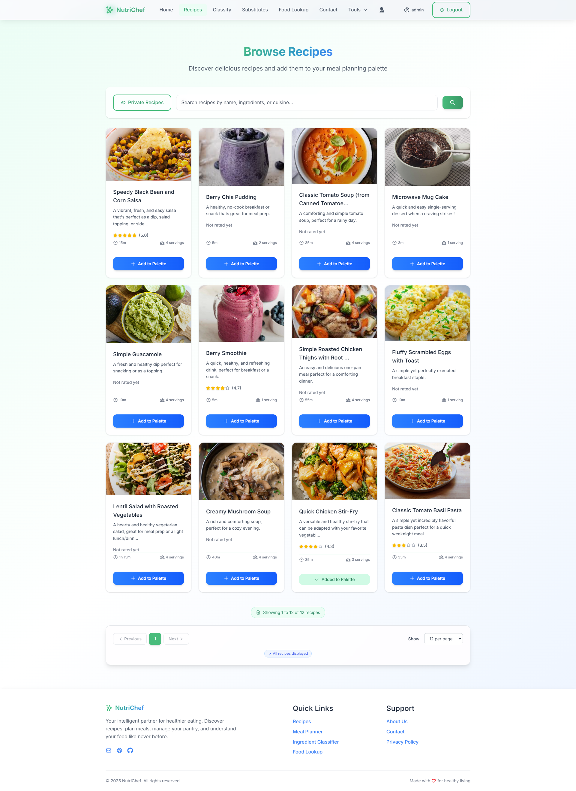
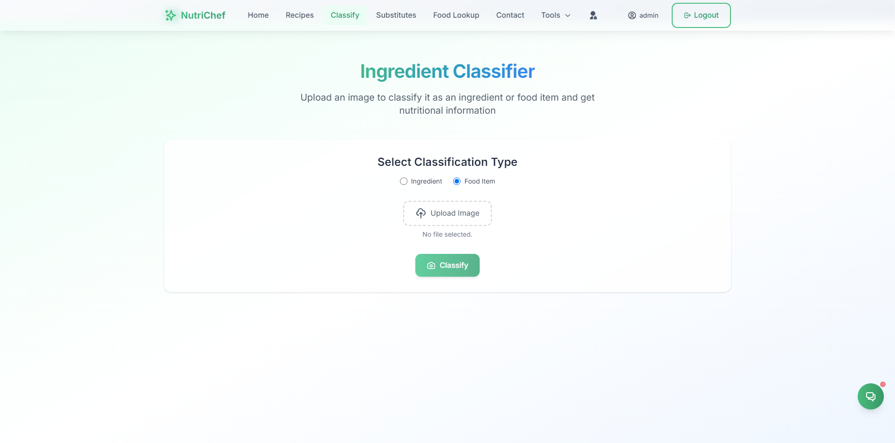
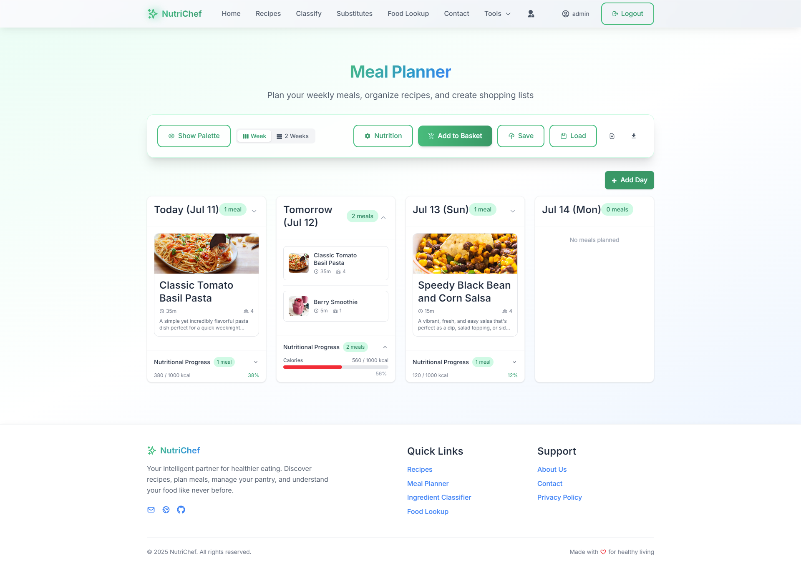

# NutriChef User Manual

Welcome to NutriChef! This manual guides you through the application's features.

## For General Users

### 1. Account Management

#### 1.1. Registration
To use NutriChef, you first need to register an account.
- Navigate to the registration page (`UserRegistration.jsx`).
- Fill in the required details (name, email, password).
- Upon submission, a verification email will be sent to your email address.
<!-- Optional relevant image: user_login_screenshot.png (as no registration_screenshot exists) -->

#### 1.2. Email Verification
- Check your email for a message from NutriChef.
- Click the verification link in the email. This will verify your account via the verification page (`EmailVerificationPage.jsx`).

#### 1.3. Login
- Once your email is verified, you can log in.
- Go to the login page (`LoginPage.jsx`) and enter your email and password.

### 2. Recipes

#### 2.1. Browsing Recipes
- Explore available recipes on the recipe browser page (`PublicRecipeBrowser.jsx`).

#### 2.2. Viewing Recipe Details
- Click on any recipe in the browser to see its full details on the recipe detail page (`RecipeDetailPage.jsx`).

- **Ingredient Substitution:** On this page, you can find substitutes for ingredients listed in the recipe.
- **Add to Shopping Basket:** Add ingredients from the recipe directly to your shopping basket.
- **Add to Meal Planner:** Add the current recipe to your meal plan.

#### 2.3. Adding/Uploading Recipes
- NutriChef allows you to add your own recipes. You can choose to make them public or private.
- **Structured Upload:** Use a form to enter recipe details (title, ingredients, instructions, image, etc.).
- **Easy Upload (Paste Text):** Paste your recipe text (ingredients and instructions), and the system's parser will attempt to structure and upload it for you.
<!-- Optional relevant image: recipe_upload_screenshot.png -->

*(Note: The specific page for recipe upload might be accessed via a button on the recipe browser or a dedicated user section and may utilize a modal like `RecipeSubmissionModal.jsx`.)*

### 3. AI-Powered Tools

#### 3.1. Ingredient Classification
- Navigate to the classification page (`IngredientClassifier.jsx`).
- Upload an image of a food item or ingredient.
- The system will classify it and provide general nutrition information.

#### 3.2. Food Nutrition Lookup
- Access the food nutrition lookup page (`FoodLookupPage.jsx`).
- Enter the name of a food item to get its detailed nutritional information.

#### 3.3. Ingredient Substitution Finder
- Use the substitute page (`IngredientSubstitutePage.jsx`).
- Input an ingredient or food name to find suitable substitutes.
<!-- No direct substitute_page_screenshot.png, using classifier_screenshot.png as a general AI tool placeholder -->

### 4. Meal & Pantry Management

#### 4.1. Meal Planner
- Go to the meal planner page (`MealPlanner.jsx`).
- Plan your meals for up to two weeks.
- You can download your meal plan as a PDF or TXT file.

#### 4.2. Pantry Management
- Access your personal pantry on the pantry page (`PantryPage.jsx`).
- Upload your current ingredients to the pantry.
- The system can track these ingredients and may suggest recipes based on what you have (e.g., when a user-defined threshold is met).

#### 4.3. Shopping Basket
- Manage your shopping list on the basket page (`ShoppingBasketPage.jsx`).
- Ingredients added from recipes will appear here.
- Generate your final shopping list from this page.
<!-- No direct shopping_basket_screenshot.png, using pantry_page_screenshot.png as related functionality placeholder -->

### 5. User Settings & Contact

#### 5.1. Account Settings
- Go to the settings page (`UserSettingsPage.jsx`).
- Update your password.
- Manage your allergy information. Recipes and recommendations will be filtered based on these settings.

#### 5.2. Contact Us
- If you have queries, use the contact us page (`ContactUsPage.jsx`) to send a message to the administrators.

---

## For Administrators

Administrators have access to all user functions, plus the following:

### 1. Admin Dashboard
- Access the main admin dashboard (`AdminDashboard.jsx` via `/admin`) for an overview and navigation to admin sections.

### 2. User Management
- Manage user accounts via the user management page (`UserManagementPage.jsx`).
<!-- No direct user_management_screenshot.png, use admin_dashboard_screenshot.png as a general admin area placeholder -->

### 3. Recipe Management
- Oversee and manage all recipes on the platform through the recipe management page (`RecipeManagementPage.jsx`).
<!-- No direct recipe_management_screenshot.png, use admin_dashboard_screenshot.png as a general admin area placeholder -->

### 4. Classification Scores
- Monitor the performance and scores of the AI classification models on the classification scores page (`ClassificationScoresPage.jsx`).

<!-- No direct classification_scores_screenshot.png, use admin_dashboard_screenshot.png as a general admin area placeholder -->

### 5. Respond to User Messages
- View and reply to user queries submitted via the Contact Us form. This is handled through the admin contact messages page (`AdminContactMessagesPage.jsx`). Admins typically reply via email.

